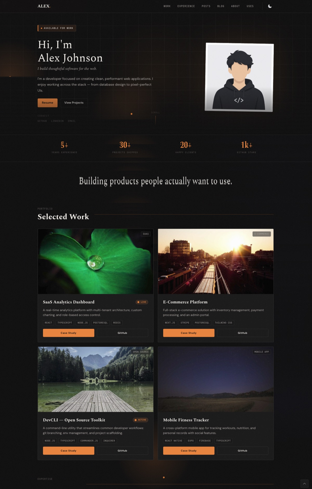

# Folio — Minimalist Astro Portfolio Theme

A highly customizable, blazing-fast, and minimalist portfolio theme built with **Astro v5** and **Tailwind CSS**. Designed for developers, designers, and creators who want a premium aesthetic with zero bloat.



## ✨ Features

- 🚀 **Built with Astro v5** — Zero JavaScript by default, incredibly fast.
- 🎨 **Premium Aesthetics** — Dark/Light mode, glassmorphism, subtle micro-animations.
- 📝 **Markdown/MDX Ready** — Built-in content collections for Blog, Projects, and Experience.
- ⚙️ **Single Config File** — Update all your personal data, links, and text from one simple `src/config.ts` file.
- 💯 **Perfect Lighthouse Score** — 100/100 across Performance, Accessibility, Best Practices, and SEO.
- 📱 **Fully Responsive** — Looks great on all devices.

## 🚀 Quick Start

1. **Clone the repository:**
   ```bash
   git clone https://github.com/fazleyrabby/folio-astro.git my-portfolio
   cd my-portfolio
   ```

2. **Install dependencies:**
   ```bash
   npm install
   # or pnpm install / yarn install
   ```

3. **Start the development server:**
   ```bash
   npm run dev
   ```

## 🛠️ Customization

Folio is designed to be personalized in under 5 minutes without touching any layout code.

Open `src/config.ts` and replace the dummy data with your own:

```typescript
export const CONFIG = {
  name: "Alex Johnson",
  title: "Full-Stack Developer",
  email: "hello@example.com",
  // ... update socials, nav links, and text!
};
```

### Adding Content

All content is managed via Astro's Content Collections. Just drop markdown files into the respective folders:

- **Blog Posts:** `src/content/blog/`
- **Projects:** `src/content/projects/`
- **Experience:** `src/content/experiences/`
- **About/Uses Pages:** `src/content/about.md` and `src/content/uses.md`

## 📦 Deployment

This theme is configured for static site generation (SSG). You can deploy it to Vercel, Netlify, GitHub Pages, or any other static host.

```bash
npm run build
```

The output will be in the `dist/` directory.

## 📄 License

MIT License — Feel free to use this for your personal or commercial projects.
